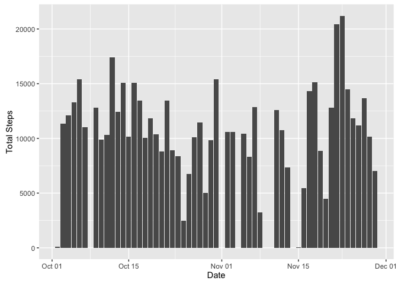
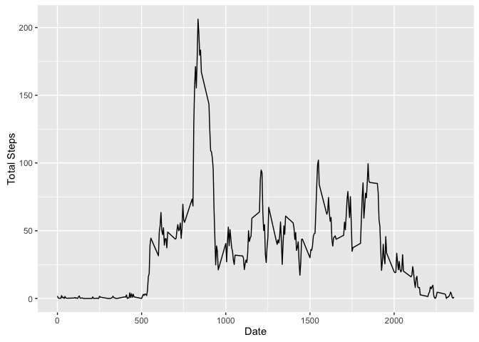

# Reproducible Research: Peer Assessment 1

## Loading and preprocessing the data

---

Unzip the activity.zip and read it into a data table by `read.csv()`.

```r
filename <- "activity.zip"
if ( file.exists(filename) ) {
    unzip(filename)
}

dt <- read.csv("./activity.csv")
dt$date <- as.Date(dt$date)
```

## What is mean total number of steps taken per day?

---


```r
library(dplyr)
library(ggplot2)
res <- dt %>% group_by(date) %>% summarise(steps = sum(steps))
g <- ggplot(res,aes(date,steps))
g + geom_bar(stat = "identity") + 
    xlab("Date") + 
    ylab("Total Steps")
```

\


## What is the average daily activity pattern?

---


```r
res <- dt %>% group_by(interval) %>% summarise(steps = mean(steps,na.rm=TRUE))
g <- ggplot(res,aes(interval,steps))
g + geom_line() + 
    xlab("Date") + 
    ylab("Total Steps")
```

\

## Imputing missing values


## Are there differences in activity patterns between weekdays and weekends?
